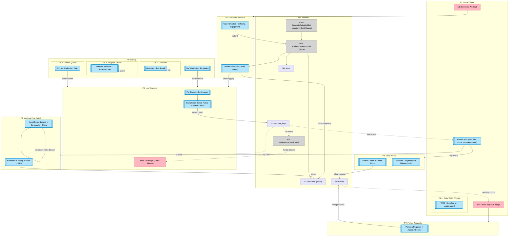

# Blood Sweat Beers — Breadboard

Designed from Shape A parts. This is a Rails 8 / Hotwire app — UI affordances are server-rendered views; Turbo Frames and Turbo Streams handle partial updates. Code affordances are Rails controllers and service objects.

---

## Places

| # | Place | Description |
|---|-------|-------------|
| P1 | Home / Feed | Main feed: own + accepted followers' workout posts; nav bar |
| P1.1 | Daily WOD Widget | Subplace of P1: today's WOD, inline log form, live leaderboard |
| P2 | Generate Workout | Type/duration/difficulty/equipment inputs → generated workout preview |
| P3 | Log Workout | Per-exercise set logging, completion form, sweat rating, post to feed |
| P4 | Workout Post Detail | Full post: logged exercises, sweat rating, likes, flat comments, clone |
| P5 | Library | Tabs: My Workouts / Templates / Friends' Queue / Calendar / Progress |
| P5.1 | Calendar View | Subplace of P5: monthly heatmap of workout history |
| P5.2 | Progress Charts | Subplace of P5: per-exercise metric charts (Chartkick + Groupdate) |
| P5.3 | Friends' Queue | Subplace of P5: cloned workouts saved to attempt later |
| P6 | User Profile | Avatar, stats, follow button, workout list (accepted followers only) |
| P7 | Follow Requests | Pending inbound follow requests — accept or decline |
| P8 | Backend | Rails controllers, service objects, Solid Queue jobs, DB tables |

---

## UI Affordances

| # | Place | Component | Affordance | Control | Wires Out | Returns To |
|---|-------|-----------|------------|---------|-----------|------------|
| U1 | P1 | nav-bar | Navigation (Feed / Generate / Library / Profile) | render | → P1/P2/P5/P6 | — |
| U2 | P1 | feed | Workout post card list | render | — | — |
| U3 | P1 | feed | "Generate Workout" FAB button | click | → P2 | — |
| U4 | P1 | follow-badge | Follow requests notification badge (count) | click | → P7 | — |
| U5 | P1.1 | wod-widget | WOD title, description, scoring type badge | render | — | — |
| U6 | P1.1 | wod-widget | WOD exercise list | render | — | — |
| U7 | P1.1 | wod-widget | "Log my result" button | click | → U8 | — |
| U8 | P1.1 | wod-log-form | Score input (seconds / reps / kg, based on scoring_type) | type | — | — |
| U9 | P1.1 | wod-log-form | "Rx" (as-prescribed) checkbox | toggle | — | — |
| U10 | P1.1 | wod-log-form | Notes field | type | — | — |
| U11 | P1.1 | wod-log-form | Submit button | click | → N10 | — |
| U12 | P1.1 | wod-widget | Leaderboard (top WOD entries, Turbo Frame) | render | — | — |
| U13 | P1.1 | wod-widget | "My result" confirmation (shown after submit) | render | — | — |
| U14 | P1 | post-card | User avatar, name, workout type badge, date, sweat rating | render | — | — |
| U15 | P1 | post-card | Exercise summary (first 3 exercises, truncated) | render | — | — |
| U16 | P1 | post-card | Like button + count (Turbo Frame) | click | → N15 | — |
| U17 | P1 | post-card | Comment count link | click | → P4 | — |
| U18 | P1 | post-card | Clone button | click | → N17 | — |
| U19 | P1 | post-card | Tap card → post detail | click | → P4 | — |
| U20 | P1 | feed | Infinite scroll trigger (bottom sentinel) | scroll | → N19 | — |
| U21 | P2 | generator-form | Workout type selector (Deka / Hyrox) | select | — | — |
| U22 | P2 | generator-form | Duration input (minutes) | type | — | — |
| U23 | P2 | generator-form | Difficulty selector (beginner / intermediate / advanced) | select | — | — |
| U24 | P2 | generator-form | Equipment checkboxes (sled, ski erg, row, etc.) | toggle | — | — |
| U25 | P2 | generator-form | "Generate" button | click | → N20 | — |
| U26 | P2 | workout-preview | Generated workout: exercises, sets, reps, rest (Turbo Frame) | render | — | — |
| U27 | P2 | workout-preview | Loading spinner (while generating) | render | — | — |
| U28 | P2 | workout-preview | "Start Logging" button | click | → P3 | — |
| U29 | P2 | workout-preview | "Save as Template" button | click | → N22 | — |
| U30 | P2 | workout-preview | "Regenerate" button | click | → N20 | — |
| U31 | P3 | workout-header | Workout type, duration, source info | render | — | — |
| U32 | P3 | exercise-list | Exercise name, target sets / reps / rest | render | — | — |
| U33 | P3 | set-logger | Set row: reps + weight inputs (or time / distance) | type | → N30 | — |
| U34 | P3 | set-logger | "Add set" button | click | → U33 | — |
| U35 | P3 | set-logger | "Exercise done" checkmark | click | — | — |
| U36 | P3 | progress-bar | Exercises completed / total | render | — | — |
| U37 | P3 | completion-form | "Complete Workout" button | click | → U38 | — |
| U38 | P3 | completion-form | Sweat rating selector (1–5 drops) | select | — | — |
| U39 | P3 | completion-form | Notes field (ActionText rich text) | type | — | — |
| U40 | P3 | completion-form | Location input (optional freeform) | type | — | — |
| U41 | P3 | completion-form | Visibility toggle (public / private) | toggle | — | — |
| U42 | P3 | completion-form | "Post to Feed" button | click | → N35 | — |
| U43 | P3 | pr-notification | PR badge (Turbo Stream, appears after logging) | render | — | — |
| U44 | P4 | post-header | User avatar, name, date, location, type badge | render | — | — |
| U45 | P4 | post-detail | Full exercise list with logged values (sets/reps/weight/time) | render | — | — |
| U46 | P4 | post-detail | Sweat rating display | render | — | — |
| U47 | P4 | post-detail | Notes display (ActionText) | render | — | — |
| U48 | P4 | post-detail | PR badges (if any PRs were set in this session) | render | — | — |
| U49 | P4 | post-actions | Like button + count (Turbo Stream) | click | → N50 | — |
| U50 | P4 | post-actions | Clone button | click | → N52 | — |
| U51 | P4 | comments | Flat comments list | render | — | — |
| U52 | P4 | comments | Comment form (textarea + submit) | type/click | → N54 | — |
| U53 | P5 | library-tabs | Tabs: My Workouts / Templates / Queue / Calendar / Progress | select | → P5.1/P5.2/P5.3 | — |
| U54 | P5 | workout-list | Own previous workouts list | render | — | — |
| U55 | P5 | workout-list | Workout card (type, date, sweat rating) | click | → P4 | — |
| U56 | P5 | template-list | Saved templates list | render | — | — |
| U57 | P5 | template-list | "Use template" button | click | → P3 | — |
| U58 | P5.1 | calendar | Monthly heatmap (cells shaded by workout count) | render | — | — |
| U59 | P5.1 | calendar | Day cell tap | click | → N70 | — |
| U60 | P5.1 | day-detail | Workouts on selected date (mini list) | render | — | — |
| U61 | P5.2 | progress | Exercise selector dropdown | select | → N72 | — |
| U62 | P5.2 | progress | Chartkick line chart (metric over time) | render | — | — |
| U63 | P5.2 | progress | PR milestone markers on chart | render | — | — |
| U64 | P5.3 | queue | Cloned workouts list (from other users) | render | — | — |
| U65 | P5.3 | queue | "Start this workout" button | click | → P3 | — |
| U66 | P5.3 | queue | Source attribution ("from @username") | render | — | — |
| U67 | P6 | profile-header | Avatar, name, bio | render | — | — |
| U68 | P6 | profile-stats | Workouts logged, PRs, followers, following counts | render | — | — |
| U69 | P6 | follow-actions | "Request to Follow" button (not yet following) | click | → N80 | — |
| U70 | P6 | follow-actions | "Requested" button (pending, tap to cancel) | click | → N82 | — |
| U71 | P6 | follow-actions | "Following" / "Unfollow" button | click | → N82 | — |
| U72 | P6 | workout-list | User's workout list (visible only to accepted followers) | render | — | — |
| U73 | P7 | requests | Pending inbound follow requests list | render | — | — |
| U74 | P7 | requests | "Accept" button per request | click | → N91 | — |
| U75 | P7 | requests | "Decline" button per request | click | → N92 | — |

---

## Code Affordances

| # | Place | Component | Affordance | Control | Wires Out | Returns To |
|---|-------|-----------|------------|---------|-----------|------------|
| N1 | P1 | FeedController#index | Loads WorkoutLogs WHERE user_id = current OR user_id IN accepted_follower_ids AND visibility != private; ordered by completed_at DESC | call | → S2, S5 | → U2, U14, U15 |
| N2 | P1 | WodsController#today | Loads today's Wod with top 10 WodEntries ordered by score | call | → S8, S9 | → U5, U6, U12 |
| N3 | P1 | FollowsController#pending_count | Count of pending inbound Follow records (following_id = current_user) | call | → S5 | → U4 |
| N10 | P1.1 | WodEntriesController#create | Creates WodEntry (user_id, wod_id, score, rx, notes, logged_at); broadcasts leaderboard update via Turbo Stream | call | → S9, N11 | → U12, U13 (Turbo Stream) |
| N11 | P1.1 | Turbo Stream broadcast | Broadcasts updated leaderboard partial to all subscribers on wod channel | broadcast | — | → U12 |
| N15 | P1 | LikesController#toggle | Creates or destroys Like record; broadcasts updated like button + count via Turbo Stream | call | → S6 | → U16 (Turbo Stream) |
| N17 | P1 | WorkoutsController#clone | Duplicates Workout (source_workout_id set, status=queued, user_id=current) | call | → S1 | → flash "Added to queue" |
| N19 | P1 | FeedController#index (page N) | Next page of feed (Turbo Frame lazy load, appends to feed) | call | → S2 | → U2 (Turbo Frame append) |
| N20 | P2 | WorkoutsController#create | POST /workouts; calls WorkoutGenerator.call with params; returns Turbo Frame with preview | call | → N21 | → U26, U27 (Turbo Frame) |
| N21 | P2 | WorkoutGenerator.call | Ruby service: selects exercises from S10, formats jsonb structure based on type/duration/difficulty/equipment; Hyrox sim uses fixed station order + run segments | call | → S1, S10 | → N20 |
| N22 | P2 | WorkoutsController#save_template | PATCH /workouts/:id; sets status=template | call | → S1 | → flash "Saved as template" |
| N30 | P3 | ExerciseLogsController#create | Creates ExerciseLog with sets_data jsonb [{reps, weight, time, distance}] | call | → S3 | — |
| N35 | P3 | WorkoutLogsController#create | Creates WorkoutLog (workout_id, user_id, completed_at, sweat_rating, notes, location, visibility); calls N36 | call | → N36, S2 | → P4 (redirect after create) |
| N36 | P3 | PRDetectionService.call | Compares each ExerciseLog value vs historical PersonalRecords for user + exercise; writes new record if best | call | → S4 | → N37 |
| N37 | P3 | Turbo Stream broadcast | Broadcasts PR badge notification after WorkoutLog created | broadcast | — | → U43 |
| N50 | P4 | LikesController#toggle | Creates/destroys Like; Turbo Stream updates like button + count on post | call | → S6 | → U49 (Turbo Stream) |
| N52 | P4 | WorkoutsController#clone | Copies Workout to current user queue (source_workout_id set) | call | → S1 | → flash "Added to queue" |
| N54 | P4 | CommentsController#create | Creates Comment (user_id, workout_log_id, body, created_at); Turbo Stream appends to comment list | call | → S7 | → U51 (Turbo Stream append) |
| N60 | P5 | LibraryController#index | Loads user's own Workouts (status: active/template) and queued Workouts (status: queued) | call | → S1, S2 | → U54, U56, U64 |
| N70 | P5.1 | WorkoutLogsController#by_date | Loads WorkoutLogs WHERE completed_at::date = selected_date | call | → S2 | → U60 |
| N71 | P5.1 | WorkoutLogsController#calendar | Loads WorkoutLog counts grouped by date using Groupdate | call | → S2 | → U58 |
| N72 | P5.2 | ExerciseLogsController#history | Loads exercise_logs for given exercise_id + user, ordered by logged date | call | → S3, S4 | → U62, U63 (Chartkick data) |
| N80 | P6 | FollowsController#create | Creates Follow (follower_id=current, following_id=target, status=pending, requested_at=now) | call | → S5 | → U70 (Turbo Frame swap) |
| N82 | P6 | FollowsController#destroy | Destroys Follow record (unfollow or cancel pending request) | call | → S5 | → U69 (Turbo Frame swap) |
| N90 | P7 | FollowsController#index | Loads pending inbound Follows (following_id=current, status=pending) | call | → S5 | → U73 |
| N91 | P7 | FollowsController#update (accept) | PATCH follow status=accepted; Turbo Stream removes request from list | call | → S5 | → U73 (Turbo Stream remove) |
| N92 | P7 | FollowsController#update (decline) | PATCH follow status=declined, then destroys record; Turbo Stream removes request | call | → S5 | → U73 (Turbo Stream remove) |
| N100 | P8 | GenerateDailyWodJob | Solid Queue recurring job (runs at midnight); checks last 7 wod types for balance; calls WorkoutGenerator with least-used type + difficulty; creates Wod + Workout for next day | job | → N21, S1, S8 | — |

---

## Data Stores

| # | Place | Store | Description |
|---|-------|-------|-------------|
| S1 | P8 | workouts | user_id, type, duration_mins, difficulty, status (template/active/queued), structure (jsonb), source_workout_id |
| S2 | P8 | workout_logs | user_id, workout_id, completed_at, sweat_rating (1–5), notes, location, visibility (public/private) |
| S3 | P8 | exercise_logs | workout_log_id, exercise_id, sets_data (jsonb: [{reps, weight, time, distance}]) |
| S4 | P8 | personal_records | user_id, exercise_id, metric (weight/time/reps/distance), value, achieved_at, workout_log_id |
| S5 | P8 | follows | follower_id, following_id, status (pending/accepted), requested_at, accepted_at |
| S6 | P8 | likes | user_id, workout_log_id, created_at |
| S7 | P8 | comments | user_id, workout_log_id, body, created_at |
| S8 | P8 | wods | date (unique), title, description, workout_id (FK), scoring_type (time/reps/weight/rounds) |
| S9 | P8 | wod_entries | user_id, wod_id, score (numeric), rx (boolean), notes, logged_at |
| S10 | P8 | exercises | name, type, movement_pattern, equipment, format_tags (deka/hyrox) |

---

## High-Level Place Flow (Mermaid)

The diagram shows place-to-place navigation and key Turbo Stream / Turbo Frame connections. Individual affordances are in the tables above.

